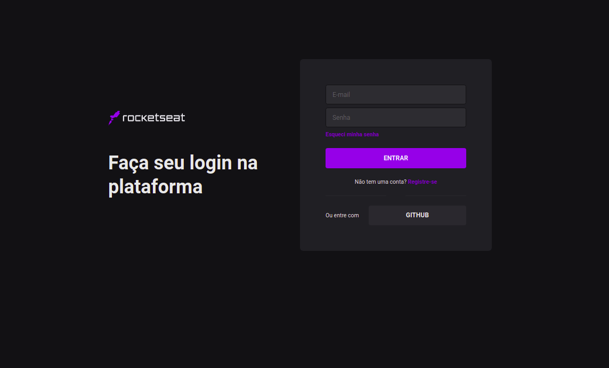

<h1>Interface de login da Rocketseat</h1>
<p>Interface de login da Rocketseat criada com ReacJS e Next aplicanto Design Systems com Chakra UI</p>

  

## Getting Started

Execute um dos comandos abaixo para instalar as dependências:

```bash
npm install
# ou
yarn
```

Execute o servidor de desenvolvimento:

```bash
npm run dev
# ou
yarn dev
```

A página estará disponível em [http://localhost:3000](http://localhost:3000), basta acessar pelo navegador.

## Learn More

To learn more about Next.js, take a look at the following resources:

- [Next.js Documentation](https://nextjs.org/docs) - learn about Next.js features and API.
- [Learn Next.js](https://nextjs.org/learn) - an interactive Next.js tutorial.

You can check out [the Next.js GitHub repository](https://github.com/vercel/next.js/) - your feedback and contributions are welcome!

## Deploy on Vercel

The easiest way to deploy your Next.js app is to use the [Vercel Platform](https://vercel.com/import?utm_medium=default-template&filter=next.js&utm_source=create-next-app&utm_campaign=create-next-app-readme) from the creators of Next.js.

Check out our [Next.js deployment documentation](https://nextjs.org/docs/deployment) for more details.
